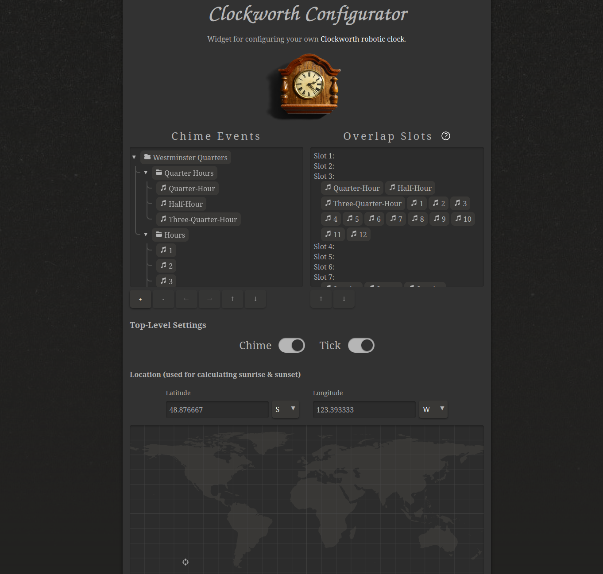

# Clockworth Configurator
Widget for configuring your own [Clockworth robotic clock](https://github.com/petermarkley/clockworth).

This is hosted live at [petermarkley.com/clockworth-conf/](https://petermarkley.com/clockworth-conf/).

# Details
This GUI is used for [configuring the chimes](https://github.com/petermarkley/clockworth/wiki/Software#chimes) of Clockworth. In the end it will give you a JSON config file which is in turn readable by [this script file](https://github.com/petermarkley/clockworth/blob/master/scripts/chime.php).

For complete instructions on building and using Clockworth, see [here](https://github.com/petermarkley/clockworth/wiki).

